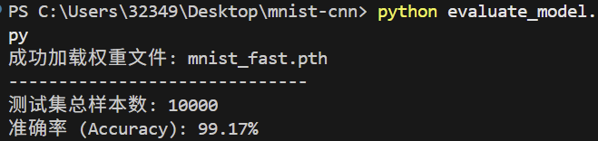
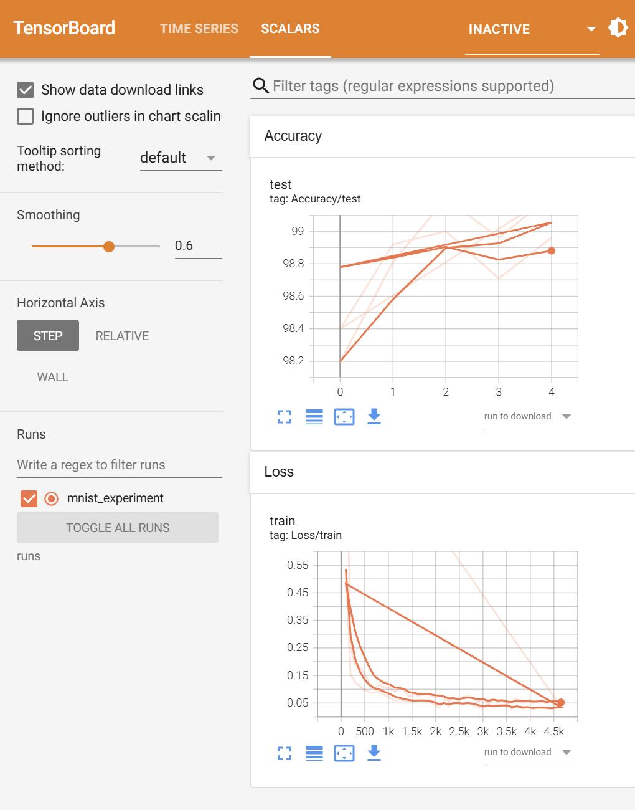

# MNIST CNN Classification手写数字识别 (PyTorch)

A simple Convolutional Neural Network (CNN) trained on MNIST with sufficient comments.

## Features
- 99% accuracy with only a few epochs
- Clean CNN implementation for beginners
- GPU acceleration supported
- Easy to read & modify


**20260330 update:**
1. 优化了模型 增加了正则化和随机dropout
2. 训练脚本增加了模块化 可变参数 早停 集成tensorboard可视化
3. 修改了冗余文件 配置了.gitignore 其他项目会用一个utils文件提高函数复用



**未来其他可能修改：**
predict_new_data引入能识别自主上传图片的功能 目前为随机抽取数据集中的图片

## How to Run
可以修改参数 并运行evaluate/predict脚本 仅展示train脚本的运行命令
```bash
pip install -r requirements.txt
python train.py
```
唤起可视化界面：
```bash
tensorboard --logdir=runs
```


